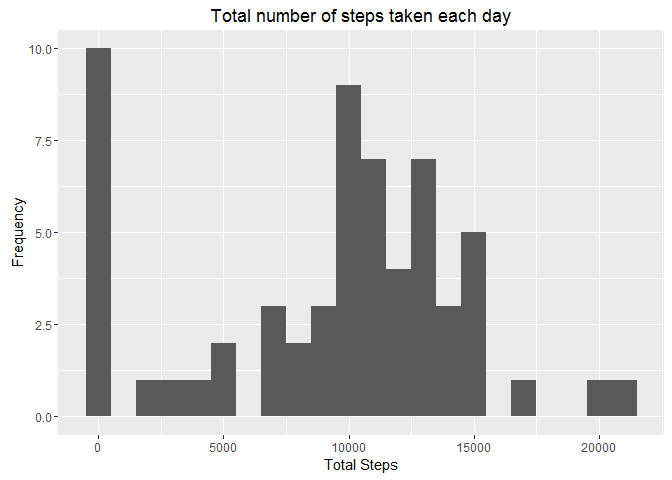
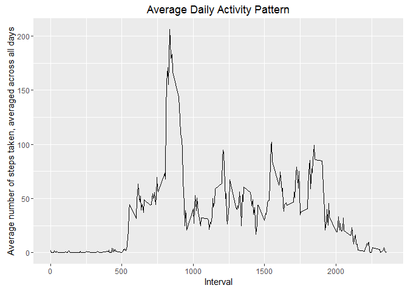
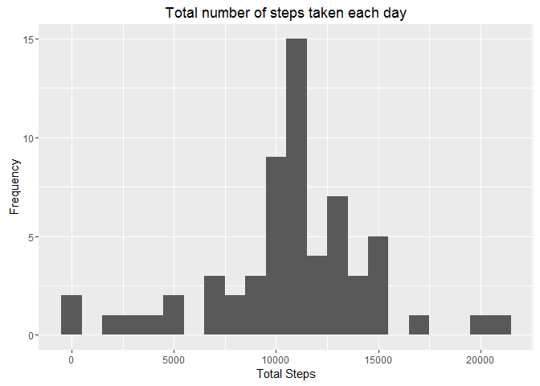
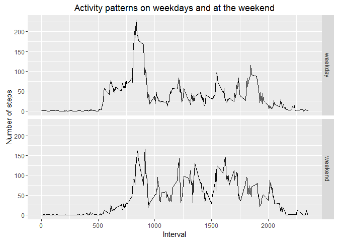

# Reproducible Research: Peer Assessment 1


## Loading and preprocessing the data
The following R code unzips the Activity data and reads the resulting CSV file into the activity data.frame.

```r
unzip("activity.zip", "activity.csv")
activity <- read.csv("activity.csv")
```
Now we "clean" the data by converting the date string in the date column to the Date class.

```r
library(dplyr)
```

```
## 
## Attaching package: 'dplyr'
```

```
## The following objects are masked from 'package:stats':
## 
##     filter, lag
```

```
## The following objects are masked from 'package:base':
## 
##     intersect, setdiff, setequal, union
```

```r
library(lubridate)
```

```
## 
## Attaching package: 'lubridate'
```

```
## The following object is masked from 'package:base':
## 
##     date
```

```r
activity <- mutate(activity, date=ymd(date))
```
This shows the structure and summary of the processed/transformed data.

```r
str(activity)
```

```
## 'data.frame':	17568 obs. of  3 variables:
##  $ steps   : int  NA NA NA NA NA NA NA NA NA NA ...
##  $ date    : Date, format: "2012-10-01" "2012-10-01" ...
##  $ interval: int  0 5 10 15 20 25 30 35 40 45 ...
```

```r
summary(activity)
```

```
##      steps             date               interval     
##  Min.   :  0.00   Min.   :2012-10-01   Min.   :   0.0  
##  1st Qu.:  0.00   1st Qu.:2012-10-16   1st Qu.: 588.8  
##  Median :  0.00   Median :2012-10-31   Median :1177.5  
##  Mean   : 37.38   Mean   :2012-10-31   Mean   :1177.5  
##  3rd Qu.: 12.00   3rd Qu.:2012-11-15   3rd Qu.:1766.2  
##  Max.   :806.00   Max.   :2012-11-30   Max.   :2355.0  
##  NA's   :2304
```

## What is mean total number of steps taken per day?
Firstly, we summarise the activity data by group to allow us to generate the total steps per day. Then, we produce a histogram of the total number of steps taken each day.

```r
stepsPerDay <- summarise(group_by(activity, date), 
                         total = sum(steps, na.rm = TRUE))
library(ggplot2)
ggplot(data = stepsPerDay, aes(total)) +
  geom_histogram(binwidth = 1000) +
  labs(x="Total Steps", y="Frequency", title="Total number of steps taken each day")
```

<!-- -->

Below, is the mean and median total number of steps taken per day

```r
s <- summarise(stepsPerDay, mean = mean(total), median = median(total))
s
```

```
## Source: local data frame [1 x 2]
## 
##      mean median
##     <dbl>  <int>
## 1 9354.23  10395
```
Therefore, the mean total number of steps taken per day is 9354.23 and the median total number of steps taken per day is 10395.

## What is the average daily activity pattern?
A time series plot of the 5-minute interval (x-axis) and the average number of steps taken, averaged across all days (y-axis)

```r
averageStepsByInterval <- activity %>%
                          group_by(interval) %>%
                          summarise(average=mean(steps, na.rm = TRUE))
ggplot(data = averageStepsByInterval, aes(x = interval, y=average)) +
  geom_line() +
  labs(x="Interval", 
       y="Average number of steps taken, averaged across all days", 
       title="Average Daily Activity Pattern")
```

<!-- -->


The 5-minute interval, on average across all the days in the dataset, that contains the maximum number of steps

```r
maxInterval <- filter(averageStepsByInterval,average == max(average))
maxInterval
```

```
## Source: local data frame [1 x 2]
## 
##   interval  average
##      <int>    <dbl>
## 1      835 206.1698
```
Therefore, the 5-minute interval, that on average contains the maximum number steps, is 835 (average maximum steps = 206.1698).

## Imputing missing values
The total number of missing values in the dataset (i.e. the total number of rows with NAs)

```r
missing <- summarise(filter(activity, is.na(steps)), n = n())
missing
```

```
##      n
## 1 2304
```
Therefore, the total number of rows with missing step values is 2304.

Below, we replace the missing values with the average steps for the respective interval.

```r
completeactivity <- activity %>%
                    left_join(averageStepsByInterval, by = "interval") %>%
                    mutate(steps = ifelse(is.na(steps), average, steps))
```
The following checks that we no longer have any missing values in the steps variable.

```r
summarise(filter(completeactivity, is.na(steps)), n = n())
```

```
##   n
## 1 0
```
The code below generates a histogram of the total number of steps taken each day.

```r
completeStepsPerDay <- summarise(group_by(completeactivity, date), 
                         total = sum(steps))
ggplot(data = completeStepsPerDay, aes(total)) +
  geom_histogram(binwidth = 1000) +
  labs(x="Total Steps", y="Frequency", title="Total number of steps taken each day")
```

<!-- -->

Below, is the mean and median total number of steps taken per day.

```r
s <- summarise(completeStepsPerDay, mean = mean(total), median = median(total))
s
```

```
## Source: local data frame [1 x 2]
## 
##       mean   median
##      <dbl>    <dbl>
## 1 10766.19 10766.19
```
Therefore, the mean total number of steps taken per day is 10766.19 and the median total number of steps taken per day is 10766.19. Imputing missing data has moved the median and the mean to the same point, and both the median and the mean are greater than before imputing. The bi-modal nature of the histogram before imputing has been replace with a uni-modal roughly uniform distribution.

## Are there differences in activity patterns between weekdays and weekends?
Creating a new data.frame from the imputed data.frame and adding a daytype variable with is a factor variable with two levels, "weekday" and "weekend".

```r
completeactivity <- mutate(completeactivity, daytype=factor(ifelse(wday(date) %in% c(1,7), "weekend", "weekday")))
averageStepsByDayTypeAndInterval <- completeactivity %>%
                                  group_by(daytype, interval) %>%
                                  summarise(average=mean(steps, na.rm = TRUE))
```
Below is a panel plot of the 5-minute interval against the average steps for each of the factor levels; "weekday","weekend".

```r
ggplot(data = averageStepsByDayTypeAndInterval, aes(x=interval, y=average)) +
                geom_line() +
                facet_grid(daytype ~ .) +
                labs(x="Interval", y="Number of steps", title="Activity patterns on weekdays and at the weekend")
```

<!-- -->

The plots appear to show that on a weekday the maximum number of steps are in the morning around 8:35am with another spike in the evening around 6pm. At the weekend, perhaps as a consequence of people having the more free time for exercise, the number of steps are spread over the day roughly from 8:30am until 8pm. Weekdays have a higher average maximum total steps than at the weekend.
